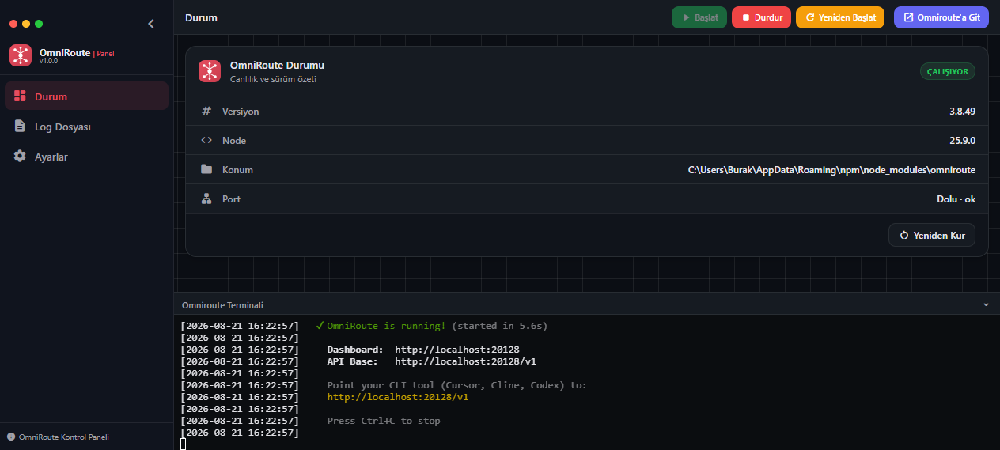
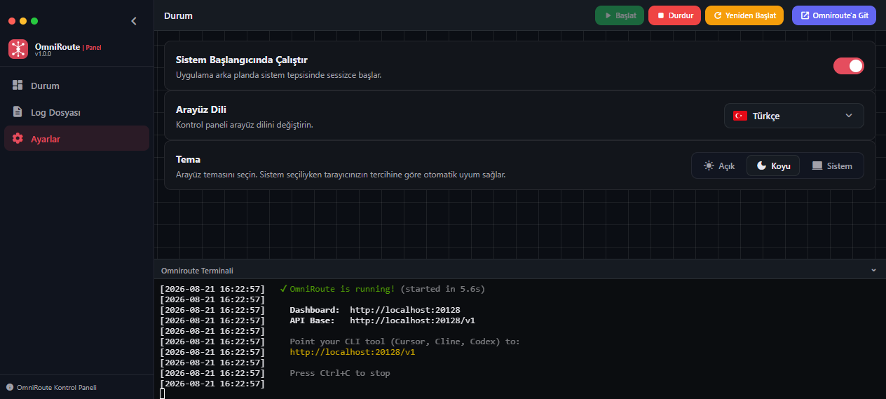

# OmniRoute Kontrol Paneli (orPanel)

[OmniRoute](https://github.com/TorhunORG/OmniRoute) icin capraz platform masaustu kontrol paneli — AI istek yonlendiricisi ve load balancer. orPanel sistem tepsisinde calisir, yerlesik terminal, saglik izleme ve OmniRoute icin tek tikla kurulum/guncelleme sunar.

> OmniRoute toplulugu icin ❤️ ile yapildi.

<p align="center">
  
</p>

<p align="center">
  
</p>

## Ozellikler

- **Sistem Tepsisi** — Gorev cubugundan her an erisilebilir
- **Yerlesik Terminal** — VS Code tarzi yeniden boyutlandirilabilir alt panel
- **Saglik Izleme** — Gercek zamanli OmniRoute durumu, surum kontrolu, tek tikla kurulum/guncelleme/onarim
- **Tema Sistemi** — Acik, Koyu, Sistem (otomatik algilama)
- **Coklu Dil** — Turkce, Ingilizce, Ispanyolca (genisletilebilir)
- **Capraz Platform** — Windows, macOS, Linux
- **Yonetici hakki gerektirmez** — Tasinabilir veya XDG uyumlu kurulum

## Kurulum

### 1. npm (onerilen)

```bash
npm install -g orpanel
orpanel
```

### 2. bun

```bash
bun add -g orpanel
bunx orpanel
```

### 3. curl (Linux/macOS)

```bash
curl -fsSL https://raw.githubusercontent.com/burkimen/orpanel/main/scripts/install/install.sh | sh
```

### 4. PowerShell (Windows)

```powershell
irm https://raw.githubusercontent.com/burkimen/orpanel/main/scripts/install/install.ps1 | iex
```

### 5. Homebrew

```bash
brew tap burkimen/orpanel
brew install orpanel
```

### 6. Nix

```bash
nix profile install github:burkimen/orpanel
```

### 7. mise

```bash
mise use -g ubi:burkimen/orpanel
```

## Hizli Baslangic

```bash
orpanel           # Kontrol panelini baslat
orpanel --help    # Yardimi goster
```

Tarayicinizda `http://localhost:20127` adresini acin. Panel sunlari yapar:

1. Sisteminizdeki OmniRoute'u algilar
2. Surum bilgisiyle saglik durumunu gosterir
3. OmniRoute kurulmadisa tek tikla kurulum onerir
4. Yerlesik terminalde OmniRoute loglarini gosterir

## OmniRoute Entegrasyonu

orPanel [OmniRoute](https://github.com/TorhunORG/OmniRoute) ile sorunsuz calisir:

- **Otomatik algilama** — `npm prefix -g`, NVM, sistem yollarindan OmniRoute'u bulur
- **Saglik kontrolu** — `GET /api/omni/health` surum, port, node uyumlulugu izler
- **Tek tikla islemler** — Web arayuzunden Kur, Guncelle, Onar, Yeniden Kur
- **Yerlesik terminal** — npm ciktisi yerlesik xterm'e aker
- **Surum takibi** — Yerel vs npm registry son surum karsilastirmasi, guncelleme uyarisı

## Gelistirme

```bash
git clone https://github.com/burkimen/orpanel.git
cd orpanel
go build -ldflags "-H=windowsgui" -o orPanel.exe   # Windows
go build -o orPanel                                  # Linux/macOS
```

Go 1.22+ gerektirir. Binary ile `themes/`, `locales/` dizinleri ayni yerde olmalidir.

## Mimari

```
orpanel/
├── panel.go           # HTTP sunucusu, sistem tepsisi, surec yonetimi
├── config.go          # Config yukleme/kaydetme
├── paths.go           # Capraz platform yol cozumleme
├── omni_health.go     # OmniRoute saglik kontrolleri
├── omni_install.go    # npm kurulum/guncelleme/onarim islemleri
├── autostart_*.go     # Platforma ozel otomatik baslatma
├── dialog_*.go        # Platforma ozel diyaloglar
├── web/
│   ├── templates/     # HTML sablonlari (Go embed)
│   └── static/js/     # Frontend JavaScript modulleri
├── themes/            # CSS degiskenleri (dark/light)
├── locales/           # i18n dizgileri (tr/en/es)
└── scripts/install/   # curl/irm kurulum scriptleri
```

## Lisans

[MIT](LICENSE) — [OmniRoute](https://github.com/TorhunORG/OmniRoute) toplulugu icin yapildi.
